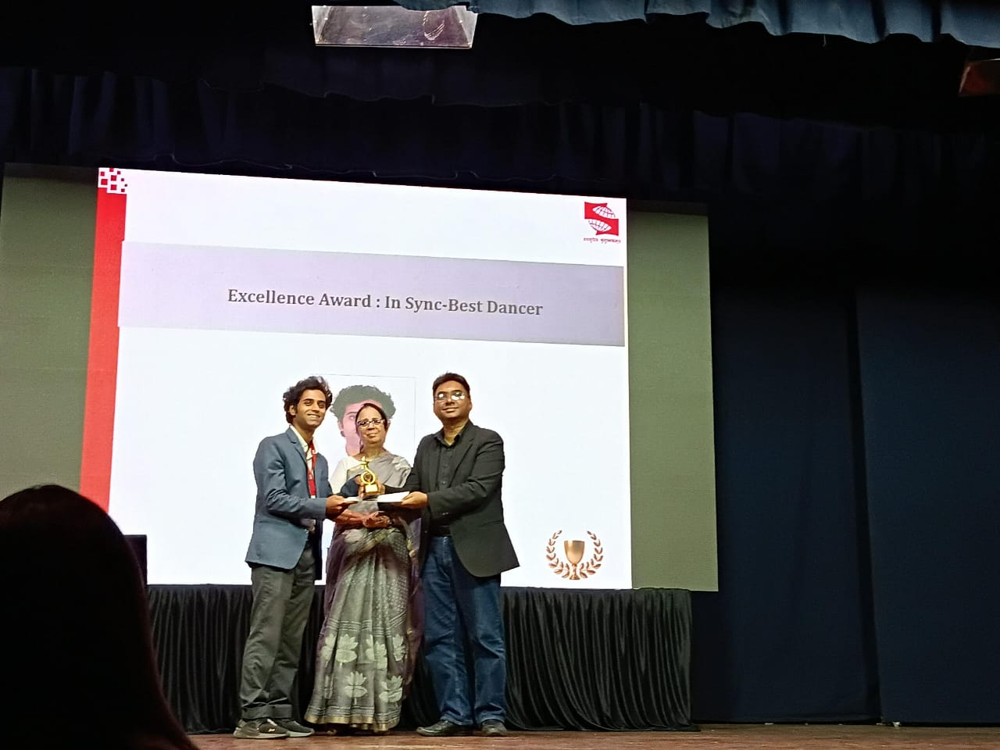

# Achievements

## Professional Achievements

### Academic Excellence Award (2023–24)

Received the Academic Excellence Award in my final year of B.A. Economics at Christ College, Pune, with a CGPA of 9.10.

---

### Academic Excellence Award (2021–22)

Received the Academic Excellence Award in the first year of B.A. Economics at Christ College, Pune, with a CGPA of 9.25.

---

### Excellence Award: InSync Best Dancer

Recognized as the Best Dancer by the InSync Dance Club for exceptional performance and contribution, showcasing creativity, discipline, and passion for the art.

---

### Y20 Fest (DY Patil University): Group Dance – Runners Up

Achieved Runners Up position in the Group Dance event at the Y20 Fest organized by DY Patil University, reflecting teamwork, creativity, and performance excellence.

---

### SCMC's Satrang: Solo Dance (Western) – 2nd Runner Up

Secured 2nd Runner Up position in the Western Solo Dance category at SCMC's Satrang cultural festival, highlighting versatility and stage presence in competitive dance.

## Certifications & Professional Development

### Introduction to Data Science in Python
**University of Michigan** - Completed comprehensive coursework in Python programming for data science, covering data manipulation, analysis, and visualization using pandas, NumPy, and matplotlib.

### Social Media Data Analytics
**University of Washington** - Specialized training in analyzing social media data patterns, sentiment analysis, and extracting insights from social platforms using advanced analytics techniques.