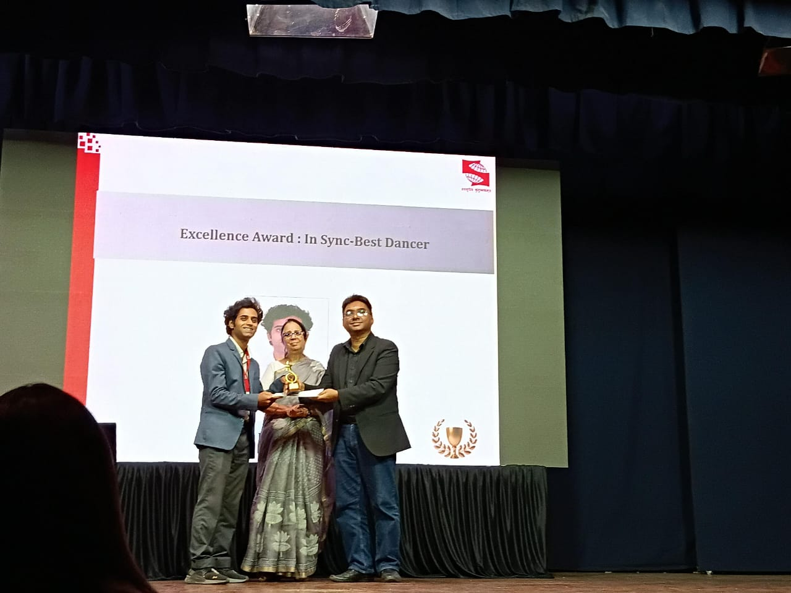
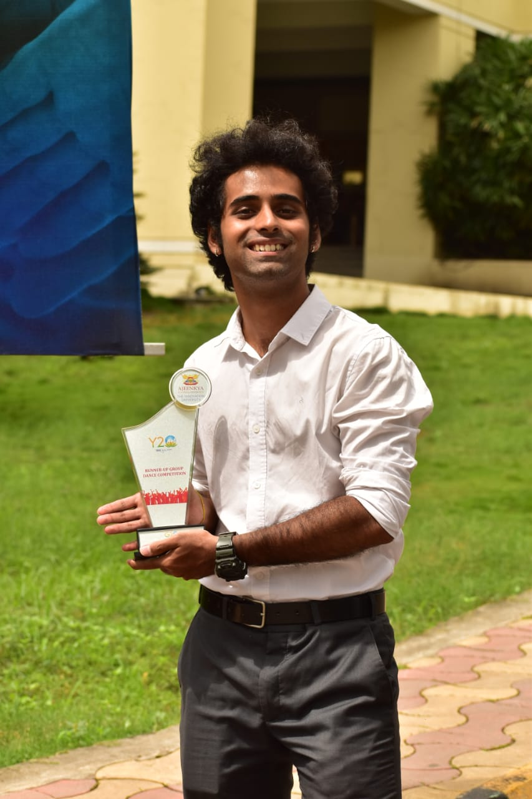
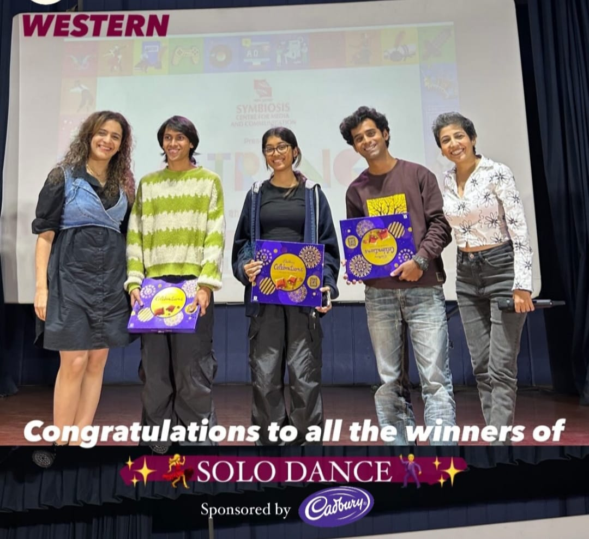

# Hi, I'm Aariz Khan

## Data Analytics Enthusiast

Welcome to my GitHub Pages site! I'm passionate about data analytics, machine learning, and extracting insights from complex datasets.

## Featured Projects

### Clustering Countries by Development Indicators
**[View Repository](https://github.com/aarizkhandata/Clustering-Countries-Development-Indicators-)**

Analysis of global development patterns using clustering techniques to group countries based on socioeconomic indicators. This project explores how different nations compare across various development metrics.

- **Tools Used:** Python, Scikit-learn, Pandas, Matplotlib
- **Techniques:** K-Means Clustering, Data Preprocessing, Statistical Analysis

### Metro Fuel Analysis
**[View Repository](https://github.com/aarizkhandata/metro-fuel-analysis)**

Comprehensive analysis of metropolitan fuel consumption patterns and pricing trends. This project examines fuel usage across different urban areas to identify patterns and insights.

- **Tools Used:** Python, Data Visualization, Statistical Analysis
- **Focus Areas:** Urban Analytics, Energy Consumption, Price Analysis

### F1 Racing Prediction using Physics-Informed ML
**[View Repository](https://github.com/aarizkhandata/F1-Racing-Prediction-Project-Plan-using-Physics-Informed-Machine-Learning)**

An innovative approach to Formula 1 race prediction by combining traditional machine learning with physics-informed models. This project integrates racing physics with data-driven predictions.

- **Tools Used:** Machine Learning, Physics-Based Modeling
- **Innovation:** Physics-Informed Neural Networks (PINNs)
- **Domain:** Sports Analytics, Predictive Modeling

## Achievements

### Professional Achievements

#### Academic Excellence Award (2023–24)

Received the Academic Excellence Award in my final year of B.A. Economics at Christ College, Pune, with a CGPA of 9.10.

---

#### Academic Excellence Award (2021–22)

Received the Academic Excellence Award in the first year of B.A. Economics at Christ College, Pune, with a CGPA of 9.25.

---

#### Excellence Award: InSync Best Dancer

Recognized as the Best Dancer by the InSync Dance Club for exceptional performance and contribution, showcasing creativity, discipline, and passion for the art.

---

#### Y20 Fest (DY Patil University): Group Dance – Runners Up

Achieved Runners Up position in the Group Dance event at the Y20 Fest organized by DY Patil University, reflecting teamwork, creativity, and performance excellence.

---

#### SCMC's Satrang: Solo Dance (Western) – 2nd Runner Up

Secured 2nd Runner Up position in the Western Solo Dance category at SCMC's Satrang cultural festival, highlighting versatility and stage presence in competitive dance.

### Certifications & Professional Development

#### Introduction to Data Science in Python -
**University of Michigan** - Completed comprehensive coursework in Python programming for data science, covering data manipulation, analysis, and visualization using pandas, NumPy, and matplotlib.

#### Social Media Data Analytics -
**University of Washington** - Specialized training in analyzing social media data patterns, sentiment analysis, and extracting insights from social platforms using advanced analytics techniques.
## Skills & Technologies

- **Programming:** Python, R, SQL
- **Machine Learning:** Scikit-learn, TensorFlow, PyTorch
- **Data Analysis:** Pandas, NumPy, Statistical Modeling
- **Visualization:** Matplotlib, Seaborn, Plotly
- **Tools:** Jupyter Notebook, Google Colab

## About Me

I'm a data enthusiast with a passion for uncovering insights from complex datasets. My work spans various domains including:

- **Development Economics:** Analyzing global socioeconomic patterns
- **Urban Analytics:** Understanding metropolitan trends and patterns  
- **Sports Analytics:** Applying advanced ML techniques to racing predictions

## Get In Touch

- 📧 **GitHub:** [@aarizkhandata](https://github.com/aarizkhandata)
- 🔗 **LinkedIn:** [Connect with me](https://www.linkedin.com/in/aariz-aslam-khan-3a1381339/)
- 📊 **Portfolio:** Explore my repositories above

---

*This site is built with GitHub Pages and the Cayman theme. Feel free to explore my projects and reach out for collaborations!*

## Recent Updates

- **Ongoing:** Working on physics-informed machine learning for F1 predictions
- **Recent:** Completed clustering analysis of global development indicators

> "Data is the new oil, but analytics is the engine that transforms it into insights."
